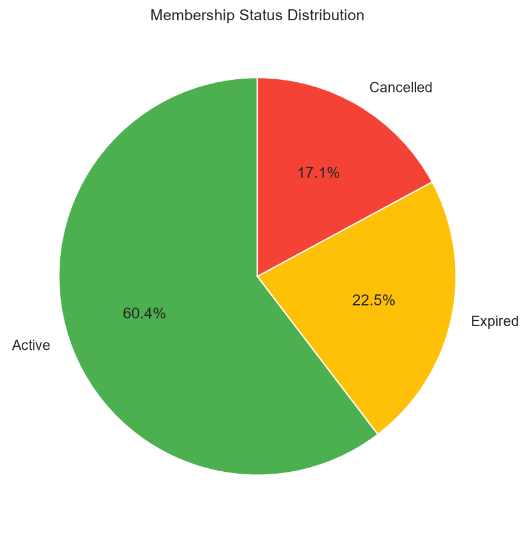
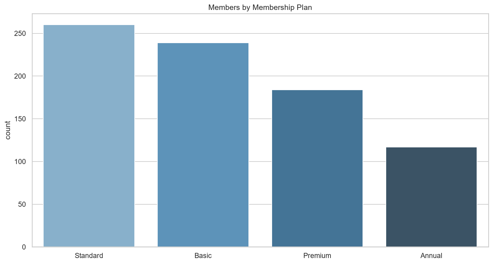
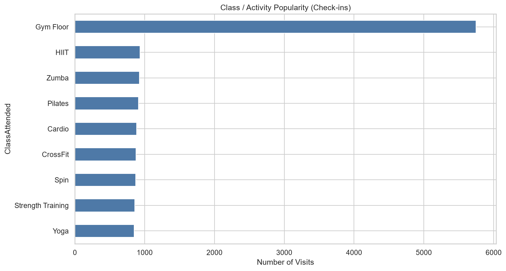
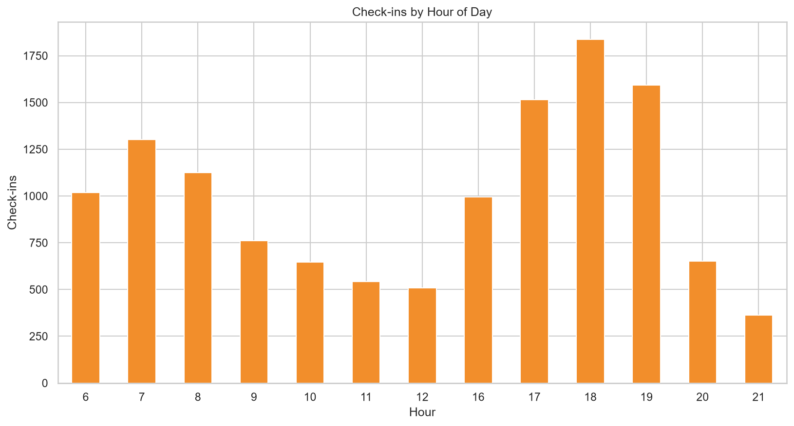

# 🏋️ Gym Membership & Fitness Analytics

End-to-end **Python-only** data analytics project that explores gym memberships, member attendance, class popularity, peak hours, and retention using a clean modular code structure.

---

## 📌 Project Overview

This project analyzes 800 gym members and 12,800+ check-ins to answer key questions related to membership plans, active vs cancelled members, class popularity, peak hours, day-of-week traffic, demographics, and visit frequency by plan.

Unlike the main business portfolio projects, this one uses **no SQL and no Power BI**.  
It is fully built with modular Python code to demonstrate clean project structure and pure Python analytics skills.

The complete pipeline follows:

**Load → Clean → Analyze → Visualize**

---

## 🛠️ Tools & Technologies

- **Python 3** – Core programming language
- **Pandas & NumPy** – Data manipulation
- **Matplotlib & Seaborn** – Charts and visual insights
- Modular project structure (`src/`, `data/`, `outputs/`, `notebooks/`)
- **Git & GitHub** – Version control and project showcase

---

## ✨ Key Features

- Overall summary metrics (total members, active rate, check-ins, avg visits)
- Membership plan breakdown and active rates
- Class / activity popularity analysis
- Peak hours and day-of-week traffic
- Demographics (age group, gender, city)
- Visit frequency by membership plan
- Modular Python codebase (separate files for loading, cleaning, analysis, visualization)
- Exploratory Jupyter Notebook

---

## 📈 Key Insights

- About 60% of members are currently Active
- Annual plans show the highest active rate
- Gym Floor is the most used activity, followed by HIIT, Zumba, and Pilates
- Peak check-in hours are in the evening (around 5–7 PM)
- Visit frequency varies clearly by membership tier
- Early-tenure and cancelled members show lower engagement

---

## 📁 Project Structure

```
Gym-Membership-Fitness-Analytics/
├── data/
│   ├── raw/
│   │   ├── members.csv
│   │   └── checkins.csv
│   └── processed/
│       ├── members_cleaned.csv
│       ├── checkins_cleaned.csv
│       └── member_activity.csv
├── src/
│   ├── __init__.py
│   ├── data_loading.py
│   ├── data_cleaning.py
│   ├── analysis.py
│   └── visualization.py
├── notebooks/
│   └── exploratory_analysis.ipynb
├── outputs/
│   └── charts/
├── main.py
├── requirements.txt
├── .gitignore
└── README.md
```

---

## 🚀 How to Run the Project

### 1. Install Dependencies
```bash
pip install -r requirements.txt
```

### 2. Run Full Pipeline
```bash
python main.py
```

This will:
- Load the raw datasets (members + check-ins)
- Clean and process the data
- Print key insights
- Generate and save all charts to `outputs/charts/`

### 3. Run Individual Modules (Optional)
```bash
python src/data_loading.py
python src/data_cleaning.py
python src/analysis.py
python src/visualization.py
```

### 4. Explore with Jupyter Notebook (Optional)
```bash
jupyter notebook notebooks/exploratory_analysis.ipynb
```

---

## 📊 Charts Generated

| File | Description |
|------|-------------|
| `01_membership_status.png` | Active / Expired / Cancelled distribution |
| `02_members_by_plan.png` | Members by membership plan |
| `03_active_rate_by_plan.png` | Active rate by plan |
| `04_class_popularity.png` | Most popular classes / activities |
| `05_peak_hours.png` | Check-ins by hour of day |
| `06_day_of_week.png` | Traffic by day of week |
| `07_demographics.png` | Age group and gender distribution |
| `08_visits_by_plan.png` | Visit frequency by membership plan |

---

## 🖼️ Screenshots

### Python Visualizations





---

## 👤 Author

**Mubeen Salman**  
Aspiring Data Analyst  

- LinkedIn: [https://www.linkedin.com/in/mubeen-salman-459776364/]  
- GitHub: [https://github.com/MuhammadMubeen04]  

---

## 📄 License

This project is for educational and portfolio purposes.
